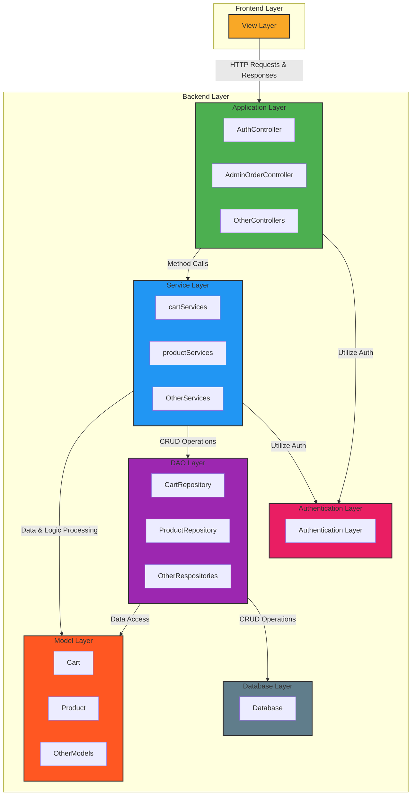
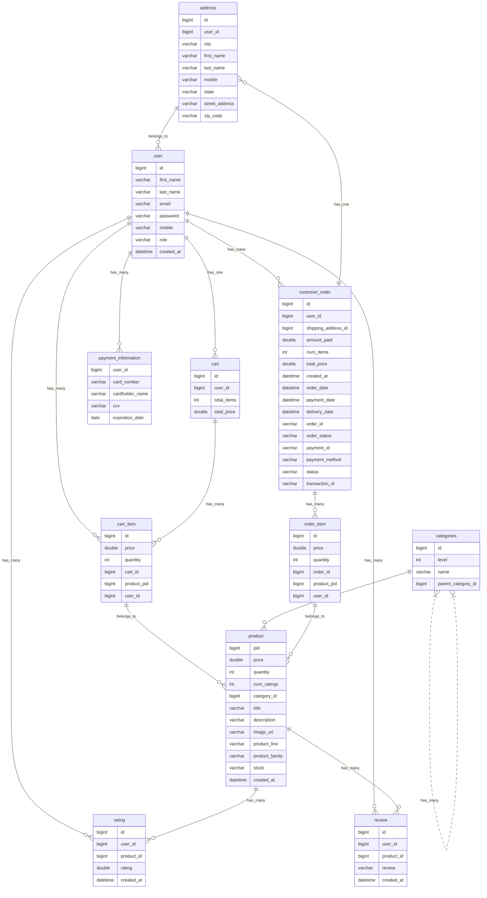

# O'Reilly 2.0
    O-O-O
          🤚
      😣/
     _/|| 
    _/¯  ¯\_

    O’Reilly
     👋
        \😩
         || \_
       _/¯¯\_

     Auto Parts
          🤚
      😳/
     _/|| 
    _/¯  ¯\_
An e-commerce platform inspired by O'Reilly, implemented using Spring Boot and Spring Data JPA for the backend. React, JS, and TailWind CSS for the front end.

# Overview
This project is using an N-tier architecture, which divides the application into three logical layers: the presentation layer, the business layer, and the data layer. The presentation layer handles the user interface and interactions, while the business layer implements the application's logic and processes, and the data layer stores and retrieves data. By separating these layers, we can create a flexible and modular system that's easier to develop, test, and maintain.

## Sign In or Register
1. Sign In:
    * Click on the "Sign In" button.
    * Enter your username in the "email" field.
    * Enter your password in the "password" field.
    * Click on the "Login" button.

2. Register:
    * If you're a new user, click on the "Register" option.
    * Fill in the required details to create a new account.
    * Click on the "Register" button to complete the registration process.

## Add Item To Cart
1. Select a Category:
    * Navigate through the website using the drop-down navigation menu.
    * Select a desired category to explore items.
2. Add Items to Cart:
    * Browse through the items and select one that you wish to purchase.
    * Click on the "Add to Cart" button.
3. Manage Cart:
    * Visit the cart page to view selected items.
    * Adjust the quantity of the items or remove items as per your need.

## Checkout
1. Enter Address Information:
    * On the checkout page, fill in your address details.
    * Click on "Deliver Here" after ensuring the address is correct.
2. Order Confirmation:
    * Review and confirm the details of your order.
    * Ensure all items, quantities, and pricing are correct.
3. Payment:
    * Select a payment method and enter the necessary payment details.
        * You can use a real credit card and pay me or use a test CC with the number 4242 4242 4242 4242
    * Click on "Submit Payment" to finalize your purchase.

# System Architecture
## System Diagram
* Application Layer: Manages API endpoints and HTTP request handling.
* Shopping API: Contains business logic and interacts with models and repositories for data access.
* Data Access Objects: Manages data access, potentially interacting with a database.
* Model Layer: Defines data structures and ORM entities.
* Authentication Layer: Manages auth configuration of rest endpoints using JWT token management.

## System Overview

## System Details

## System Interaction Summary
1. Frontend Layer
Responsibility: Manages user interface and experience.
Interaction: Communicates with the backend through HTTP requests and updates the UI based on the responses.
2. Backend Layer
    1. Controller Layer
        1. Responsibility: Handles HTTP requests and responses.
        2. Interaction: Receives requests from the frontend, interacts with the service layer for data processing, and sends back responses.
    2. Service Layer
        1. Responsibility: Manages business logic and data processing.
        2. Interaction: Communicates with the controller layer and accesses/modifies data through the repository layer, utilizing models for data structure.
    3. Model Layer
        1. Responsibility: Defines data structures.
        2. Interaction: Used by the service and repository layers to define and manage data.
    4. Repository Layer
        1. Responsibility: Manages data access and CRUD operations.
        2. Interaction: Interacts with the database and the service layer, using models to manage data.
3. Auth Layer
    1. Responsibility: Secures rest endpoints.
    2. Interaction: Provides authentication settings (like security and JWT management) to the controller and service layers.

### Interaction Flow:
The Frontend Layer sends HTTP requests to the Controller Layer and receives responses to update the UI. The Controller Layer communicates with the Service Layer to process requests and manage business logic.
The Service Layer interacts with the Repository Layer to access and manage data in the database, utilizing the Model Layer for data structures. The Repository Layer performs CRUD operations directly on the Database. Both the Controller and Service Layers utilize configurations from the Auth Layer.

# Entity Relationship for SQL Database

# Learnings
## Java

### Controllers
* Controllers should be as thin as possible, and they should only call at most one service layer method and not catch or throw exceptions.
* Delegate response code and error message responsibilities to a global exception handler. Exceptions should be called from the service layer which is intercepted by Spring exception handlers (ex: ControllerAdvice) where exceptions are then transformed into HTTP responses and returned to the client.
* Do not add business logic to this layer or have multiple calls within an endpoint, this is easier for testing purposes
* Validate input received in the request to ensure it is valid and meets the expected format.

### Services
* Modularity and reusability are key.
* Logging and HTTP responses should NOT be handled in the service layer. They should use exception propoagation to relay errors to the controller layer for proper logging and HTTP response translation.
* Exception handling should generally follow two rules:
    1. Some sort of recovery logic
    2. throw an api level exception to be handled by the controller layer
* Use DTOs to transfer data between the controller and the service. This helps keep the service layer decoupled from the controller layer and allows for better control over the data being transferred.

Ex: Propagating exceptions in the service layer
           
           @Service
           public class orderService {
                @Autowired
                private orderRepository orderRepository;

                pulbic Order createOrder(Order order) {
                    try {
                        Order createOrder = orderRepository.save(order);
                    } catch (specificException e) {
                        throw new ClientErrorException("Order already exists");
                    }
                }
           }
### Models
* They represent the data used by the service layer. Don't prematurely handle exceptions here.
* The only exceptions the model should handle are related to DB access. Propoage all other exceptions to the service layer.
* Use flyaway or something else for DB versioning for long term maintainability

### Client Libraries
* HTTP response codes should be converted into java exception types so the caller can hanlde the possible reponses a client call can return.

# Frontend
* Use localstorage/ sessionStorage / caching
* Minimize the amount of DB calls you need to make, networking limitations are real
* Managing state can be challenging, especially when you have lots of child components
* UseEffect is very commonly misused and error prone, there are lots of async calls which can be difficult to pin down, so you need to hanlde various states.
* Always check if the data structures (like arrays or objects) you're working with exist and have the expected format before performing operations on them. Functions like .map, .filter, and .reduce can throw errors if not used on actual arrays.
