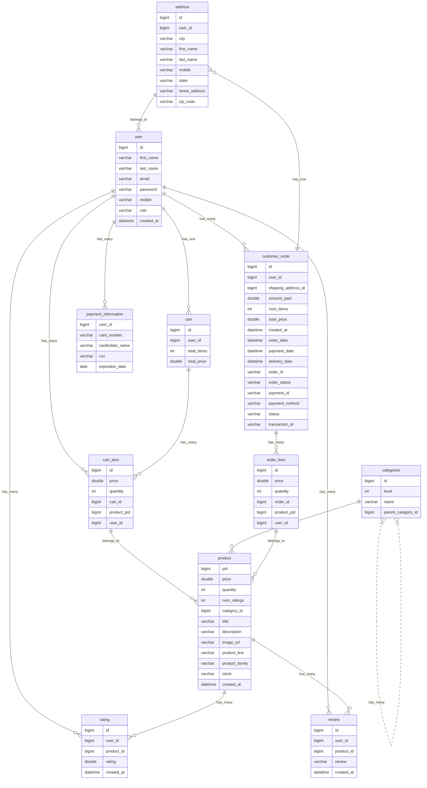

# Entity Relationship for SQL Database

```mermaid
erDiagram
    address {
        bigint id
        bigint user_id
        varchar city
        varchar first_name
        varchar last_name
        varchar mobile
        varchar state
        varchar street_address
        varchar zip_code
    }

    cart {
        bigint id
        bigint user_id
        int total_items
        double total_price
    }

    cart_item {
        bigint id
        double price
        int quantity
        bigint cart_id
        bigint product_pid
        bigint user_id
    }

    categories {
        bigint id
        int level
        varchar name
        bigint parent_category_id
    }

    customer_order {
        bigint id
        bigint user_id
        bigint shipping_address_id
        double amount_paid
        int num_items
        double total_price
        datetime created_at
        datetime order_date
        datetime payment_date
        datetime delivery_date
        varchar order_id
        varchar order_status
        varchar payment_id
        varchar payment_method
        varchar status
        varchar transaction_id
    }

    order_item {
        bigint id
        double price
        int quantity
        bigint order_id
        bigint product_pid
        bigint user_id
    }

    payment_information {
        bigint user_id
        varchar card_number
        varchar cardholder_name
        varchar cvv
        date expiration_date
    }

    product {
        bigint pid
        double price
        int quantity
        int num_ratings
        bigint category_id
        varchar title
        varchar description
        varchar image_url
        varchar product_line
        varchar product_family
        varchar stock
        datetime created_at
    }

    rating {
        bigint id
        bigint user_id
        bigint product_id
        double rating
        datetime created_at
    }

    review {
        bigint id
        bigint user_id
        bigint product_id
        varchar review
        datetime created_at
    }

    user {
        bigint id
        varchar first_name
        varchar last_name
        varchar email
        varchar password
        varchar mobile
        varchar role
        datetime created_at
    }

    address ||--o{ user : "belongs_to"
    user ||--o{ cart : "has_one"
    user ||--o{ cart_item : "has_many"
    user ||--o{ payment_information : "has_many"
    user ||--o{ rating : "has_many"
    user ||--o{ review : "has_many"
    user ||--o{ customer_order : "has_many"
    cart ||--o{ cart_item : "has_many"
    cart_item ||--o{ product : "belongs_to"
    categories ||--o{ product : "has_many"
    categories }|..|{ categories : "has_many"
    product ||--o{ rating : "has_many"
    product ||--o{ review : "has_many"
    customer_order ||--o{ address : "has_one"
    customer_order ||--o{ order_item : "has_many"
    order_item ||--o{ product : "belongs_to"

```
