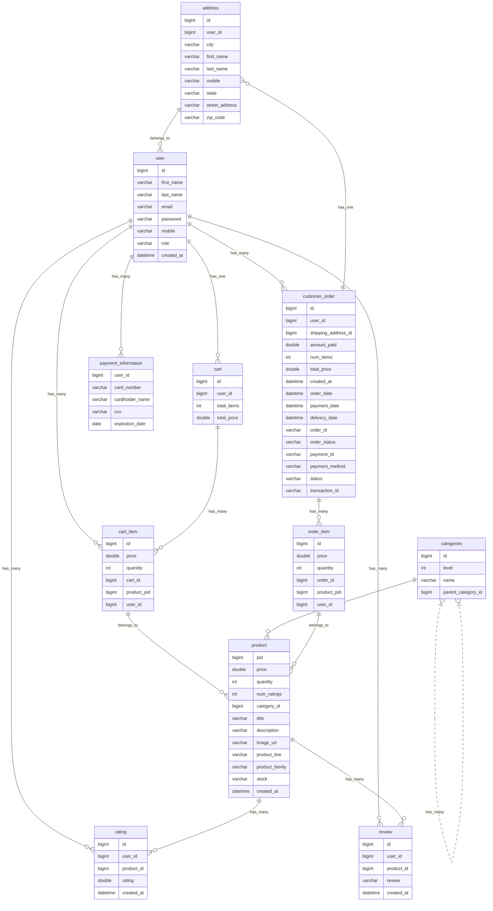

# O'Reilly 2.0
    O-O-O
          🤚
      😣/
     _/|| 
    _/¯  ¯\_

    O’Reilly
     👋
        \😩
         || \_
       _/¯¯\_

     Auto Parts
          🤚
      😳/
     _/|| 
    _/¯  ¯\_
An e-commerce platform inspired by O'Reilly, implemented using Spring Boot and Spring Data JPA for the backend. React, JS, and TailWind CSS for the front end.

# Overview
This project is using an N-tier architecture, which divides the application into three logical layers: the presentation layer, the business layer, and the data layer. The presentation layer handles the user interface and interactions, while the business layer implements the application's logic and processes, and the data layer stores and retrieves data. By separating these layers, we can create a flexible and modular system that's easier to develop, test, and maintain.

# System Architecture
## System Diagram
* Application Layer: Manages API endpoints and HTTP request handling.
* Shopping API: Contains business logic and interacts with models and repositories for data access.
* Data Access Objects: Manages data access, potentially interacting with a database.
* Model Layer: Defines data structures and ORM entities.
* Authentication Layer: Manages auth configuration of rest endpoints using JWT token management.

## System Interaction Summary
1. Frontend Layer
Responsibility: Manages user interface and experience.
Interaction: Communicates with the backend through HTTP requests and updates the UI based on the responses.
2. Backend Layer
    1. Controller Layer
        1. Responsibility: Handles HTTP requests and responses.
        2. Interaction: Receives requests from the frontend, interacts with the service layer for data processing, and sends back responses.
    2. Service Layer
        1. Responsibility: Manages business logic and data processing.
        2. Interaction: Communicates with the controller layer and accesses/modifies data through the repository layer, utilizing models for data structure.
    3. Model Layer
        1. Responsibility: Defines data structures.
        2. Interaction: Used by the service and repository layers to define and manage data.
    4. Repository Layer
        1. Responsibility: Manages data access and CRUD operations.
        2. Interaction: Interacts with the database and the service layer, using models to manage data.
3. Auth Layer
    1. Responsibility: Secures rest endpoints.
    2. Interaction: Provides authentication settings (like security and JWT management) to the controller and service layers.

### Interaction Flow:
The Frontend Layer sends HTTP requests to the Controller Layer and receives responses to update the UI. The Controller Layer communicates with the Service Layer to process requests and manage business logic.
The Service Layer interacts with the Repository Layer to access and manage data in the database, utilizing the Model Layer for data structures. The Repository Layer performs CRUD operations directly on the Database. Both the Controller and Service Layers utilize configurations from the Auth Layer.

# Entity Relationship for SQL Database

